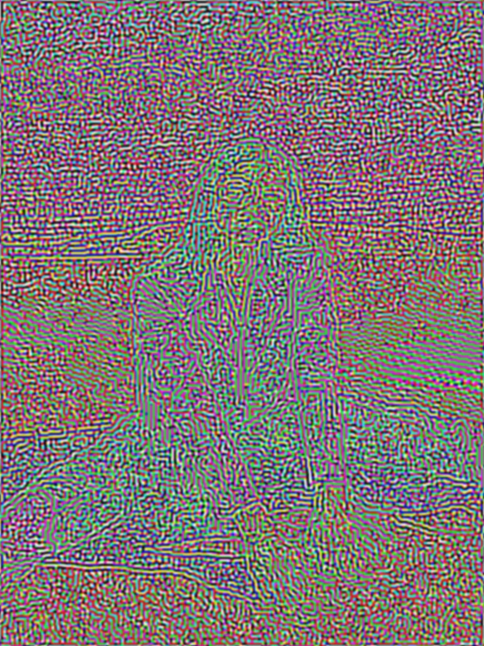
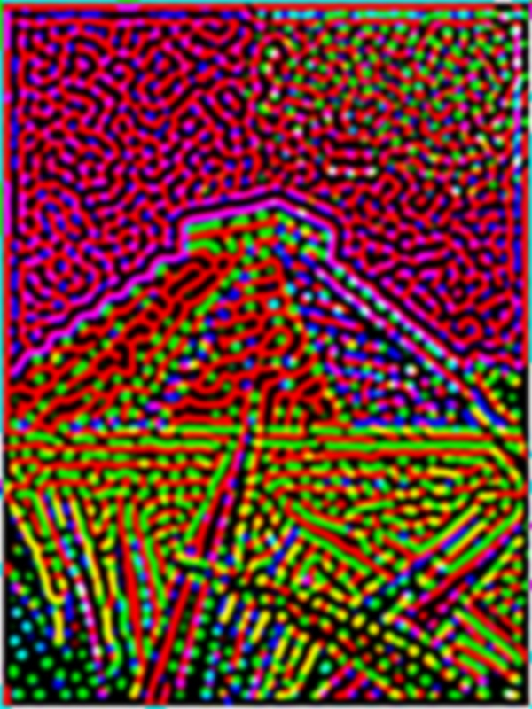
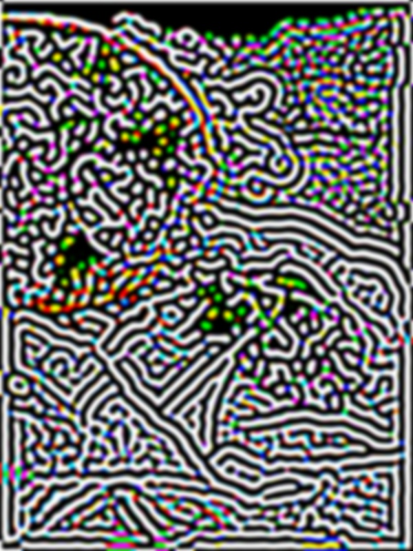

# Turing Patterns Project
#### - Built using Python3, OpenCV Module and Numpy
##### Author: Jose Renteria, for ARTD360

**User Documentation**
- Before using, ensure that the image you want to perform your processing on is inside of the `imgs/` folder
- You can verify the dependencies of the project in dependencies.txt and install them using `pip3 install opencv-python` or `pip install opencv-python`
- Invoke the program using `python3 turing_patterns.py`
    - This will prompt you for an image name (case sensitive)
    - Once running, the processing will begin and will pop up a window titled `TuringPatterns` with your original image, resized. 
    - You can press **ANY** key to show the processed image, and pressing any key again will save it to the `imgs/` folder

**Background info**
- This project is meant to simulate the reaction diffusion equations that Alan Turing talks about in his study 'Toggle the table of contents
The Chemical Basis of Morphogenesis' which describes how patterns in nature, such as stripes and spirals, can arise naturally from a homogeneous, uniform state. The theory, which can be called a reaction–diffusion theory of morphogenesis, has become a basic model in theoretical biology.[2] Such patterns have come to be known as Turing patterns. 
- Sample work
    - 
    - 

    - 
    - 

    - 
    - 
